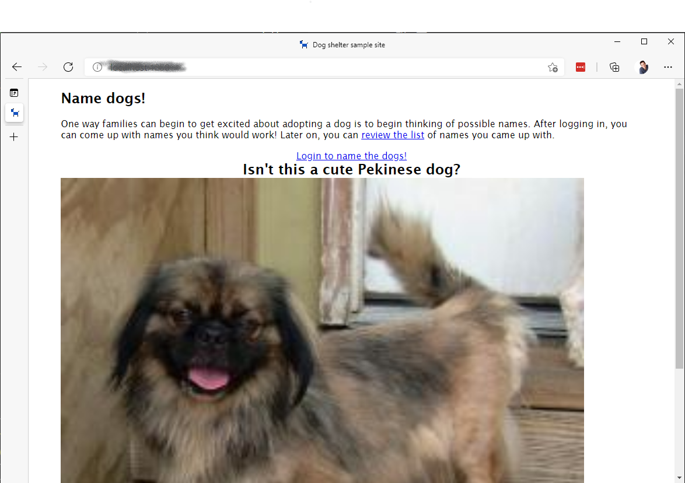

# Goal 0: Run the application locally

Whenever working on any project, step 0 is typically to fork and clone the repository, install the necessary tooling, and run the application locally. To streamline this process, The Loved Mutt have provided your team with step-by-step instructions.

## About the application

The front-end was created using [Svelte](https://svelte.dev) and [SvelteKit](https://kit.svelte.dev). No experience with Svelte is required; the only front-end code your team will need to write will be JavaScript, and a comment has been placed where the code should go.

The back-end uses [Azure Functions](https://docs.microsoft.com/azure/azure-functions/functions-overview), the Azure serverless platform. Azure Functions are supported natively by Azure Static Web Apps, which is where your team will deploy the application. As your team gets to each goal, the key files you need to use will be highlighted.

## Install workshop software

The workshop uses Azure Functions for server-side code, and MongoDB for the local database. You can install each of these by using the following resources:

- [Azure Functions Core Tools](https://www.npmjs.com/package/azure-functions-core-tools), which can be done by running the following command (after Node.js and npm are installed)

  ```bash
  npm i -g azure-functions-core-tools@3 --unsafe-perm true
  ```

- [MongoDB Community Server](https://www.mongodb.com/try/download/community)
  - [Install MongoDB Community Server on Windows](https://docs.mongodb.com/manual/tutorial/install-mongodb-on-windows/)
  - [Install MongoDB Community Server on macOS with Brew](https://docs.mongodb.com/manual/tutorial/install-mongodb-on-os-x/)
  - [Install MongoDB Community Server on Linux](https://docs.mongodb.com/manual/tutorial/install-mongodb-on-ubuntu/)
    - Note: If you are using Windows Subsystem for Linux (WSL) with Ubuntu, you can install MongoDB using the following commands

      ```bash
      sudo apt-get install mongodb
      service mongodb start # Start mongodb
      ```

> **IMPORTANT**: Make sure MongoDB is started after you install the service.

## Generate the repository and obtain the source code

The starter repository (or repo) has been created as a [GitHub template](https://docs.github.com/github/creating-cloning-and-archiving-repositories/creating-a-repository-on-github/creating-a-repository-from-a-template). One member of your team will generate a repository from this template, while the remaining team members will fork it. All team members will clone the repository locally.

1. One team member: [generate the repository](https://github.com/login?return_to=https%3A%2F%2Fgithub.com%2Fgeektrainer%2Floved-mutt%2Fgenerate). You can give the repository whatever name you like.
1. All other team members will [fork](https://docs.github.com/github/getting-started-with-github/quickstart/fork-a-repo) the new repository.
1. All team members will [clone the repository](https://docs.github.com/github/creating-cloning-and-archiving-repositories/cloning-a-repository-from-github/cloning-a-repository), which can be accomplished by running the following command.
1. For all team members, after cloning the repository, open the local folder in Visual Studio Code

## Running the application locally

After you have downloaded the source code locally, you are all set to run it! You'll rename one settings file, and then start the server!

1. Inside Visual Studio Code, locate the file named *starter-settings.json*. Rename the file to *local.settings.json*.

    *local.settings.json* contains environmental variables used by Azure Functions. For the starter project, it contains the connection string to the database, MongoDB running locally on your machine.

1. Inside Visual Studio Code, open a new terminal by selecting *Terminal* > *New Terminal*.
1. Run the following commands to change to install the packages for both the api and client, and start the development server:

    ```bash
    cd api
    npm install
    cd ..
    npm install
    npm run dev
    ```

    After the scripts have run, your dev server will be started

1. Open the website by navigating to [http://localhost:4280](http://localhost:4280)

    

## Congratulations!

Your team has successfully obtained the starter code! Now it's time to [deploy the project to the cloud](1-deploy.md).
