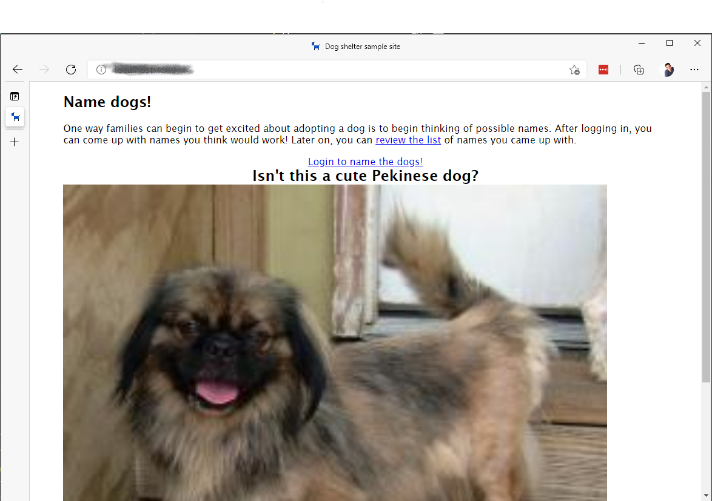

# Goal 1: Deploy to the cloud

The Loved Mutt application is a full-stack application (or sometimes called a static web app). All the necessary code for both the client and server are contained inside one project, and the client uses a framework (Svelte in this case). This is a standard way to do web development. The application also requires access to a database which uses Mongo DB APIs, and the ability to enable authentication.

For this goal, your team will deploy the application to Azure. Future goals will focus on authentication and the database.

## The Azure Service

[Azure Static Web Apps](https://docs.microsoft.com/azure/static-web-apps/overview) is a service which builds and deploys full stack web apps to Azure from a code repository. It provides hosting for static files (HTML, CSS, JavaScript, etc.) and server-side code through serverless Azure Functions. Azure Static Web Apps can host applications written with any front-end framework, including React, Angular, Vue.js and Svelte. Azure Functions can be used to access server resources such as databases or other APIs. A site deployed to Azure Static Web Apps automatically scales, and can even have custom domains.

Deployment is managed through [GitHub actions](https://github.com/features/actions). When you create a static web app, Azure will automatically create a workflow file on your GitHub repository. This allows you to use GitHub just as you normally would, and updates to *main* or whatever branch you specify are automatically deployed to Azure.

## Key files

No configuration or code updates are required to deploy the project to the cloud!

## Success criteria

Your team will work together to deploy the application to Azure using Azure Static Web Apps. Your team will have achieved this goal when the following success criteria are met:

- The shelter's site has been successfully deployed to Azure Static Web Apps
- You can open the index page on the newly created Azure Static Web App

## Validation

To validate your lab with the automated tool, enter the newly created URL on Azure Static Web Apps into the tool...

## Resources

Your team might find these resources helpful:

- [What is Azure Static Web Apps](https://docs.microsoft.com/azure/static-web-apps/overview)
- [Quickstart: Create a static web app - Azure Portal](https://docs.microsoft.com/azure/static-web-apps/get-started-portal?tabs=vanilla-javascript#create-a-static-web-app)
- [Quickstart: Building your first static site - Visual Studio Code](https://docs.microsoft.com/azure/static-web-apps/getting-started?tabs=vanilla-javascript#create-a-static-web-app)

## Tips

- After successfully deploying to Azure, run `git pull` to pull down the newly generated workflow file.
- Your team may find the [Azure Static Web Apps Visual Studio Code extension](https://marketplace.visualstudio.com/items?itemName=ms-azuretools.vscode-azurestaticwebapps) helpful
- The login page **will not** work yet; your team will enable authentication for the next goal

## Final result

After you deploy and navigate to the site, you should see a page which looks like the following:

## Next challenge

Once you've deployed your application, it's time to [add authentication](./2-authentication.md).
