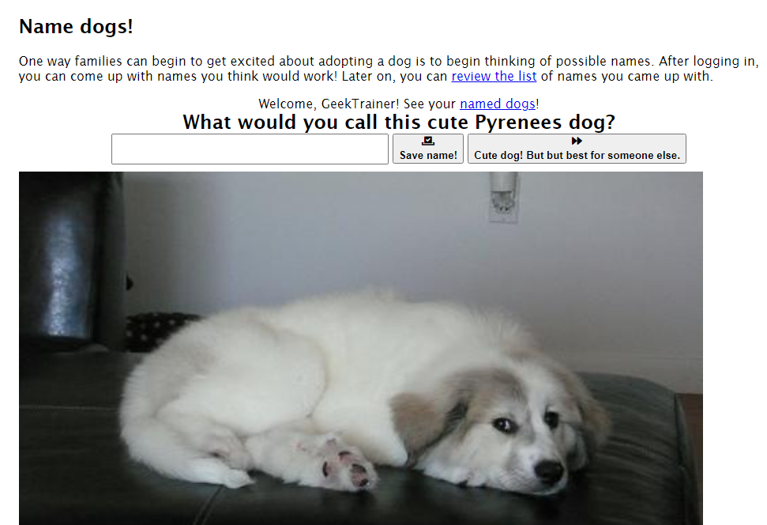

# Goal 2 - Authentication

Your team should be proud! The application is now deployed an application to the cloud!

You may remember the primary workflow for the application is to allow users to come up with names for different dogs. Because users will want to see the names they create, your team will need a way to enable authentication.

## The Azure Service

[Authentication and authorization](https://docs.microsoft.com/azure/static-web-apps/authentication-authorization) are built-in to Azure Static Web Apps. No additional configuration is required to allow users to login with Azure Active Directory, Twitter or GitHub authentication. You can add a link to the login page, and then add the necessary code to determine the name of the user and any additional actions you may wish to take.

## Key files

Open *src/routes/index.svelte*, and notice the following JavaScript function:

```javascript
async function getUserInfo() {
    // retrieve the current user from Azure Static Web Apps
    const response = await fetch("/.auth/me");
    // get the JSON
    const payload = await response.json();
    // clientPrincipal is the property with the information
    if (payload.clientPrincipal) {
        // user is authenticated
        // userDetails contains the username
        return payload.clientPrincipal.userDetails;
    } else {
        // if clientPrincipal is null, the session is anonymous
        return null;
    }
}
```

This helper function is used to retrieve the current user. The key property is `clientPrincipal`. If `clientPrincipal` is `null`, it means the user is anonymous; if it contains a value the user has authenticated. The path */.auth/me* is built-in to Azure Static Web Apps to provide access to the current user.

Further down in *index.svelte*, you will notice the following code to display the user or a link to the login page:

```html
{#await getUserInfo()}
    Getting user info...
{:then username}
    {#if username}
        <div class="center">
            Welcome, {username}! See your
            <a href="named-dogs">named dogs</a>!
        </div>

        <!-- snipped code to display buttons -->
    {:else}
        <div class="center">
            <a href="/login" class="center">Login to name the dogs!</a>
        </div>
        <!-- snipped code to display generic message -->
    {/if}
{/await}
```

The Svelte `await` is used to call `getUserInfo()`. After it's loaded, we look at the `username`. If a username exists, we display it and the buttons for naming dogs. If there is no `username`, the user is anonymous.

Notice the link to */login*. This will become **the key to this goal**. Your team will make the appropriate application updates to ensure */login* displays a login page.

> Note: The [await](https://svelte.dev/tutorial/await-blocks) and [if/else](https://svelte.dev/tutorial/if-blocks) blocks are part of [Svelte](https://svelte.dev). `await` allows you to display a loading message when making a potentially lengthy call (like accessing a server resource). `if/else` allows you to integrate logic into your HTML.

## Success criteria

Your team will make the necessary updates to the application to enable authentication. Your team will have achieved this goal when the following success criteria are met:

- The necessary updates have been applied to enable GitHub authentication via the path */login*
- After the updated site is deployed, a user can complete the following flow:
  - Navigate to the index page
  - Select the *Login to name the dogs!* link
  - Be redirected to the GitHub authentication page
  - Be redirected to the index page

## Validation

To validate your lab with the automated tool, enter the contents of *staticwebapp.config.json* into the tool...

## Resources resources

Your team might find these resources helpful:

- [Azure Static Web Apps - Login](https://docs.microsoft.com/azure/static-web-apps/authentication-authorization#login)
- [Configure Azure Static Web Apps](https://docs.microsoft.com/azure/static-web-apps/configuration)
- [Access user information in Azure Static Web Apps](https://docs.microsoft.com/azure/static-web-apps/user-information?tabs=javascript)
- [Troubleshooting deployment and runtime errors](https://docs.microsoft.com/azure/static-web-apps/troubleshooting)

## Tips

- The only file which needs to be modified is *staticwebapp.config.json*
- Remember to push updates to the main branch to redeploy to Azure Static Web Apps
- Naming dogs **will not** work yet; your team will enable the database for the next goal

## Final result

After enabling authentication and logging in via GitHub, the page should look like this:


