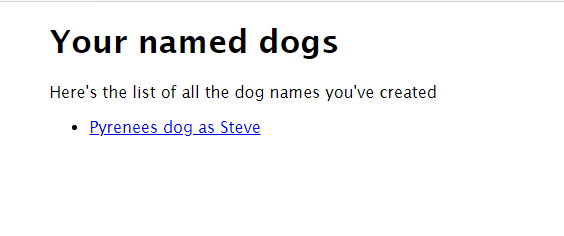

# Goal 3: Create and configure a cloud-based database

Congratulations on enabling authentication for the application! Authentication commonly a key component to any web project.

Similarly, almost every web application will need some form of a database. If you remember the primary workflow again, the goal is to have users create names for the dogs, which will then be saved to a database. The time has come for your team to create and configure the database.

## The Azure Service

[Azure Cosmos DB](https://docs.microsoft.com/azure/cosmos-db/introduction) is a document or [NoSQL](https://en.wikipedia.org/wiki/NoSQL) database service. Cosmos DB provides different APIs you can use to access it, including an [API for MongoDB](https://docs.microsoft.com/azure/cosmos-db/introduction), which allows the Node.js MongoDB client to interact with it. Most recently, [Cosmos DB serverless](https://docs.microsoft.com/azure/cosmos-db/serverless) was released, which similar to other serverless products charges are based on usage. Your team will create a Cosmos DB account and configure the application to use your new Cosmos DB deployment.

## Key files

Open */api/helpers.js*. This file contains a couple of functions to aid the development of the server-side portion of this project. The key function is `getMongoClient`.

```javascript
getMongoClient() {
    const { MongoClient } = require("mongodb");
    const uri = process.env.MONGO_CONNECTION_STRING;
    const client = new MongoClient(uri, {
        useNewUrlParser: true,
        useUnifiedTopology: true,
    });
    return client;
}
```

`getMongoClient` contains the code to connect to the database. Notice `process.env.MONGO_CONNECTION_STRING`, which is using [process.env](https://nodejs.org/dist/latest-v14.x/docs/api/process.html#process_process_env) to read an environment variable. After creating the database on Azure, your team will need to ensure the environment variable is set correctly on the static web app in Azure.

## Success criteria

Your team will create the necessary resources and make the necessary updates in Azure to enable the application to access a Cosmos DB database. Your team will have achieved this goal when the following success criteria are met:

- A Cosmos DB Account has been created
- The static web app configuration has been updated in Azure
- In the website, you are able to perform the following tasks:
  - Login to the site
  - Name a dog
  - Navigate to the favorites page by selecting *review the list* to see the dogs you named

## Validation

Have a mentor check your site to ensure everything has been completed!

## Resources

Your team might find these resources helpful:

- [Create an Azure Cosmos DB account](https://docs.microsoft.com/azure/cosmos-db/create-cosmosdb-resources-portal#create-an-azure-cosmos-db-account)
- [Get the MongoDB connection string by using the quick start](https://docs.microsoft.com/azure/cosmos-db/connect-mongodb-account#get-the-mongodb-connection-string-by-using-the-quick-start)
- [Configure application settings for Azure Static Web Apps](https://docs.microsoft.com/azure/static-web-apps/application-settings)
- [Troubleshooting deployment and runtime errors](https://docs.microsoft.com/azure/static-web-apps/troubleshooting)

## Tips

- The application will automatically create a database and collection to store data; the only resource your team needs to [create is an Azure Cosmos DB account](https://docs.microsoft.com/azure/cosmos-db/create-cosmosdb-resources-portal#create-an-azure-cosmos-db-account)

## Final result

After creating database and configuring the application, you should now be able to login, name a dog, and see the list of all dogs you've named.


